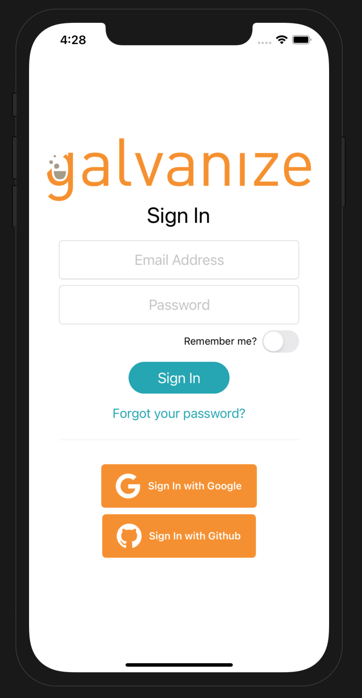
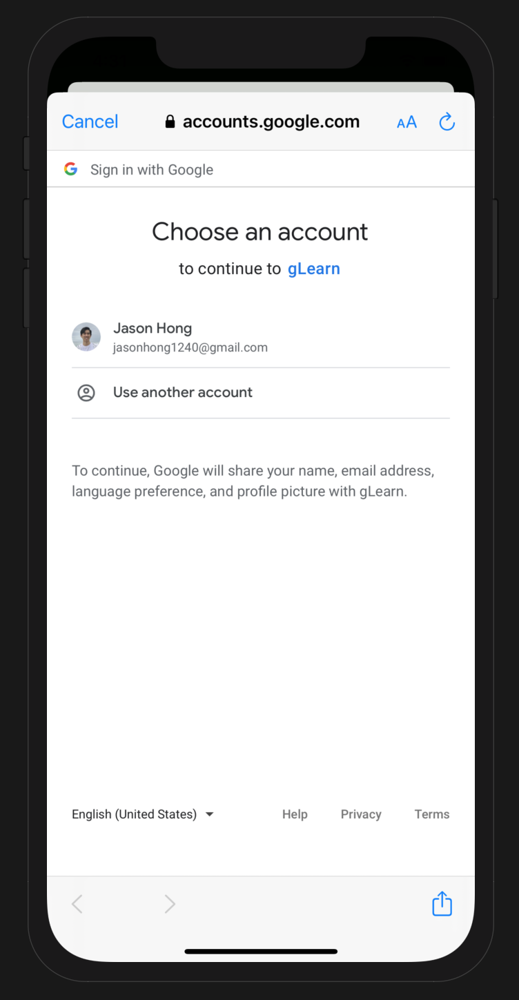
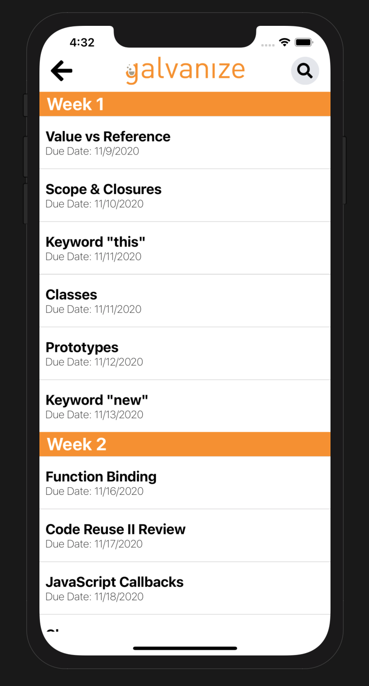
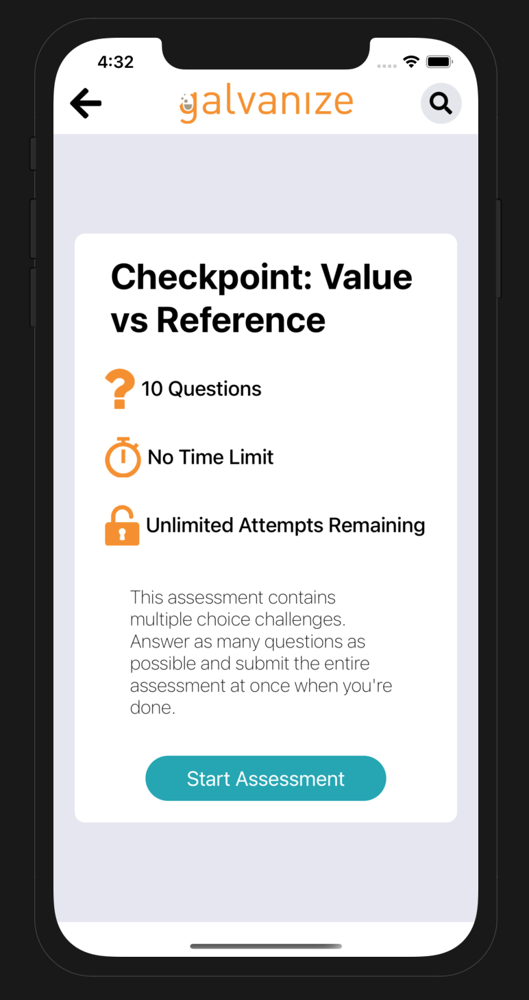
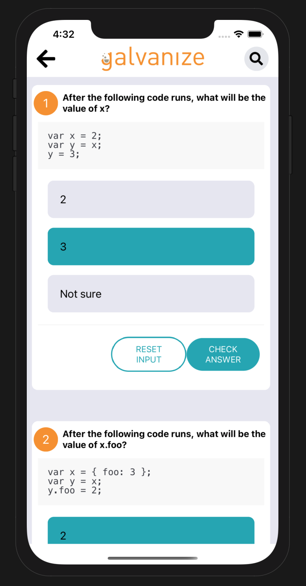

  

<h1 align="center">
  Galvanize Learn
</h1>

  A mobile adaptation of the already existing educational platform for the Galvanize @ Hack Reactor Advanced Software Engineering Immersive accessed through <a href="https://auth.galvanize.com/sign_in" target="_blank">https://auth.galvanize.com/sign_in</a>. The inspiration for adapting this application on the mobile platform was to increase its accessibility to the students enrolled in the immersive, while also implementing two, additional features: a search bar and google authentication.

## Jason's Contributions

  Demo: https://youtu.be/GUc8ovaYhDE

  Screenshots:
  
  
  
  
  

## Jeff's Contributions

## Tim's Contributions

